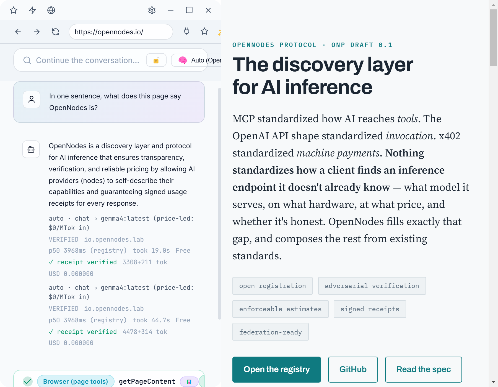

# Surge launch kit — the OpenNodes desktop client

Everything here comes from the real app (Windows 11, Electron 35) talking to the live hosted registry and live
OpenNodes nodes; the demo and stills are regenerated by one script (see the end). Nothing is mocked or staged.

Status for all copy below: **pre-release**. There's an unsigned Windows installer on [GitHub Releases](https://github.com/opennodes-io/surge/releases) (0.1.1 first); macOS and Linux are build-from-source. The repository is public at [github.com/opennodes-io/surge](https://github.com/opennodes-io/surge).

## One-liners

- **Surge: models via OpenNodes, tools via MCP, in one desktop app.**
- A desktop "browser for MCP" whose model picker is the open OpenNodes network: trust tiers, measured latency, signed receipts.
- Pick a model you can verify: every call pinned, receipted, and checked on your machine.

## Short description (≈50 words)

Surge is a desktop "browser for MCP" and the reference client for OpenNodes. Its model picker is fed live from an
OpenNodes registry; Auto picks a node per prompt on your machine; every call goes direct to the node and comes back
with a signed receipt Surge verifies. A spend policy is on from first launch, and private mode keeps everything local.

## Long description (≈150 words)

Surge puts both discovery layers in one app: **tools** through MCP (servers, an embedded browser with page tools,
MCP-UI) and **models** through the OpenNodes Protocol. The model picker lists registry offerings with their trust
tier, registry-measured latency and per-MTok price. **Auto** runs the OpenNodes advisor on your device (the prompt
never leaves it) and falls back to the next node if one is down. Invocation goes straight to the node, pinned to the
offering and card revision; a price change is re-resolved from the node's signed card and re-checked against your
spend policy before any retry. Every call's Ed25519 receipt is verified — *amount = usage × pinned price* — and shown
under the reply, and a dashboard keeps the ledger. Spending is **off** until you set a budget. One click switches to
**private mode**: your local Ollama and LAN machines only, through the embedded OpenNodes router. API keys live in the
OS keychain, one per host.

## Landing page — "A desktop client that speaks both layers (Surge)"

Replaces the current text-only Surge entry in `site/index.html` (opennodes repo). Copy the stills to `site/media/`
and the GIF to `docs/media/` (for the README) first. Uses only the page's existing styles and tokens.

```html
  <h3 style="font-size:1.05rem">A desktop client that speaks both layers (Surge)</h3>
  <p style="font-size:0.92rem;color:var(--muted)">Surge (pre-release: <a href="https://github.com/opennodes-io/surge/releases">Windows installer</a>, <a href="https://github.com/opennodes-io/surge">source on GitHub</a>) is a desktop "browser for MCP" and the reference OpenNodes client. The model picker is fed live from an ONP registry — trust tier, measured latency, per-MTok price — and <strong>Auto</strong> runs the advisor on your machine to pick a node per prompt. Every call goes direct to the node, pinned to its card revision, and comes back with a signed receipt that Surge verifies (<code>amount = usage × pinned price</code>) and shows under the reply. A spend policy is on from first launch (spending off until you set a budget), a dashboard keeps the ledger, and one click switches to <strong>private mode</strong>: your local Ollama and LAN machines only. Models via OpenNodes, tools via MCP, in one app.</p>
  <figure style="margin:1rem 0 0">
    <picture>
      <source srcset="media/surge-browser-receipt-dark.png" media="(prefers-color-scheme: dark)">
      
    </picture>
    <figcaption style="font-size:0.8rem;color:var(--muted)">A page read with an MCP browser tool, answered by a node the advisor picked — tier, measured latency, price, and the verified receipt under the reply.</figcaption>
  </figure>
```

For the repository README (opennodes repo), next to the Ollama demo:

```markdown

```

## Announcement drafts

**Short post (≤280 chars)**
> Surge, the OpenNodes desktop client: a model picker fed by the open registry (tier, measured latency, price), Auto
> routing that runs on your machine, and a verified signed receipt under every reply. Spending off by default; one
> click for local-only. Pre-release.

**Longer post**
> MCP standardized how AI reaches tools. OpenNodes standardizes how a client finds a model it doesn't already know.
> Surge is the desktop app that speaks both: tools through MCP, models through OpenNodes. Pick a node by trust tier,
> measured latency and price — or let Auto choose per prompt, on your machine. Every call is pinned to the node's
> card revision and comes back with an Ed25519 receipt Surge checks against the price you saw. A spend policy is on
> from first launch, a dashboard keeps the ledger, and private mode keeps every model call on your own machines.

## Assets (`media/`)

Stills are 2× (1800×1400; the browser shot is the app view and the embedded page stitched as on screen), each in
`-dark` and `-light`. The demo is 25 s: a 900×700 MP4 (0.5 MB) and an 800-wide GIF (2.6 MB, made from the MP4). Waits for
live model replies are compressed to about a second each; everything else plays in real time.

| File | Shows | Alt text |
|---|---|---|
| `surge-demo.gif` / `.mp4` | Launcher → model picker → Auto answers with a verified receipt → Spend dashboard → private mode answers from local Ollama | Surge picking an OpenNodes node with Auto, verifying the receipt, showing spend, then answering privately from a local model |
| `surge-browser-receipt-*.png` | Hero: opennodes.io in the embedded browser, read by an MCP page tool; Auto's pick and the verified receipt under the reply | See the landing snippet |
| `surge-picker-*.png` | The model picker: Auto first, then verified OpenNodes nodes with tier · node · measured latency · price | Surge's model picker listing Auto and verified OpenNodes nodes with trust tier, measured latency and price |
| `surge-spend-*.png` | Settings → Spend: today vs budget, 14-day total, receipts verified, calls per day, by node | Surge's spend dashboard: today's spend against the daily budget, calls per day, and receipts verified per node |
| `surge-policy-keys-*.png` | Settings → Advanced: the ONP-5 spend policy and per-host API keys | Surge's spend policy (per request, per day, price cap, minimum tier, schemes) and API keys by host |
| `surge-private-*.png` | Private mode on: the lock badge, Auto (private), an answer from local Ollama | Surge in private mode answering from a model on the local machine |

## Fact sheet — what the copy may and may not claim

Verified (by the scripts in `packages/core/test/` and in the running app):

- Live discovery from `registry.opennodes.io`; Auto routes among the **admitted** nodes (3 today) — plus imported
  catalogs you have saved a key for.
- Pinned invocation; on `409 price_changed` the node's card is fetched, schema-validated and signature-verified, the
  policy re-applied, and the call retried once or the change surfaced.
- Receipts: Ed25519 verified against the node's JWKS; amount, revision, node and offering checked; inline and by URL.
- Spend policy (per request, per day, price cap, schemes, minimum tier) enforced before every call; default spending off.
- Private mode: only local / LAN models are listed or used, and the registry is not contacted.

Don't claim:

- Anything about paid nodes in the wild — today's live admitted nodes are free; paid flows are verified against a
  test node that signs real receipts.
- macOS or Linux — only Windows has been run.
- That private mode covers tools: it scopes **model calls**; connected MCP servers and pages you open are unaffected.
- A signed installer, or macOS / Linux installers. There's an unsigned Windows pre-release only; macOS and Linux are build-from-source.

## Regenerating

```bash
pnpm --filter @surge/desktop build
node scripts/launch-kit/capture.mjs            # or --stills / --demo
```

Needs ffmpeg on PATH (or `FFMPEG=`), network access, and a local Ollama on `:11434` for the private-mode scenes
(skipped otherwise). The app runs in a throwaway profile; your settings and keys are not touched. Model replies come
from live CPU nodes, so a full run takes several minutes.
